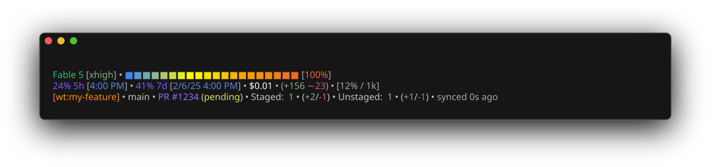
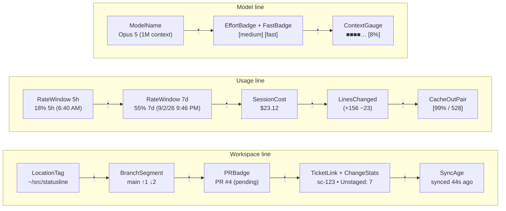

# Claude Code Statusline

[](https://github.com/okize/statusline/actions/workflows/ci.yml)

Custom status line for Claude Code that displays model info, context window usage, rate limits, and git status directly in the terminal.



The screenshot is generated from `examples/stdin-payload-example.json` by `make screenshot` and refreshed automatically when the rendered output changes (see [Development](#development)).

## What it displays

**Line 1:** Model name with bracketed reasoning effort (`Fable 5 [xhigh]`, omitted when the model doesn't support effort) plus a `[fast]` badge when fast mode is on • context window gradient bar with bracketed percentage (`[42%]`)

**Line 2:** Rate limit usage (5h/7d, subscription plans only), each with its reset time in a bracketed blue badge (`4% 5h [12:00 PM]`) • white session cost • lines added/removed (green/red, whole session) • bracketed cache hit rate and output tokens of the most recent API call (`$23.12 • (+156 −23) • [99% / 528]`). The cost segment drops when Claude Code sends no cost figure; the lines segment drops when either lines count is missing. Before the first API call renders as a skeleton with `--` placeholders.

**Line 3:** Current directory, or worktree tag (`[wt:name]`) in place of the directory when inside a git worktree • git branch with ahead/behind counts vs upstream (`↑N ↓M`, only when non-zero) • pull request badge (`PR #N (state)`, clickable, only when the branch has an open PR) • Shortcut ticket link (if branch matches `sc-#####`) and staged/unstaged file counts with insertion/deletion stats • time of the last commit

Segments are separated by ` • ` throughout. The `statusline git <dir>` subcommand is the one exception to the line-3 ordering: it keeps the sync time attached to the branch on its first line.

When Claude Code provides the terminal width (`COLUMNS`, v2.1.153+), long directory paths and branch names are truncated with a middle ellipsis (`…`).

## Component vocabulary

The output is built from four kinds of thing. Use these words in code, comments, commits, and issues — they are what the tests and the docs assume.

- **Block** — the whole rendered output: a leading blank line plus three lines.
- **Line** — one row of the block. The three are the **model line**, the **usage line**, and the **workspace line**.
- **Segment** — a top-level unit joined to its neighbours by ` • `. Segments are independently omittable; a missing one leaves no dangling separator.
- **Part** — a piece inside a segment, not separately joined (a percentage inside a rate window, the state inside a PR badge).

Each arrow below is a ` • ` separator, so every line reads left to right exactly as it renders:



Every segment maps to exactly one producer:

| Segment | Parts | Produced by | Omitted when |
|---------|-------|-------------|--------------|
| `ModelName` | — | `renderMain` (`in.ModelName`) | never |
| `EffortBadge` | — | `renderMain` (`effortDisplay`) | the model doesn't support effort |
| `FastBadge` | — | `renderMain` (`fastDisplay`) | `fast_mode` is false or absent |
| `ContextGauge` | gradient bar, `PercentLabel` | `buildContextDisplay` | never — renders a dim skeleton pre-first-call |
| `RateWindow` | `UsagePercent`, `ResetTime` badge | `rateSegment`, grouped by `buildRateDisplay` | API-key users (no `rate_limits`); each window independently. The `ResetTime` badge alone is dropped when `resets_at` is absent |
| `SessionCost` | — | `buildUsageGroup` | `cost.total_cost_usd` is absent/null |
| `LinesChanged` | — | `buildUsageGroup` | either lines field is absent |
| `CacheOutPair` | `CacheRate`, `OutputCount` joined by ` / ` | `buildUsageGroup` | never — `--` placeholders pre-first-call |
| `LocationTag` | — | `collapseHome` + `truncateMiddle`; the `WorktreeTag` variant in `renderMain` | never |
| `BranchSegment` | `BranchName`, `AheadBehind` | `renderGitLines` (`gitBranch` + `gitAheadBehind`) | non-repo (replaced by `not a git repo`) |
| `PRBadge` | `PRNumber`, `ReviewState` | `buildPRBadge` | no open PR |
| `TicketLink` | — | `detectTicket` | no tracker matches the branch |
| `ChangeStats` | `StagedStat`, `UnstagedStat` | `gitChangeStats` | non-repo; a clean tree renders `No pending changes` |
| `SyncAge` | — | `gitSyncStatus` | non-repo |

Two structural rules follow from the vocabulary:

- **Segments join with ` • `, never a pipe.** `joinSegments` does the joining and drops empties, so an absent `PRBadge` or a non-repo directory leaves no stray separator. The `CacheOutPair`'s two parts join with ` / ` inside its brackets — no pipes anywhere.
- **Parts are the producer's business.** A producer returns its segment fully assembled, including the separators *between its own parts*; the caller only places segments.

## Files

A single Go binary: a thin `main.go` that calls into the `internal/statusline` package.

| File | Purpose |
|------|---------|
| `main.go` | Entry point (`package main`). Reads stdin/args and `COLUMNS`, calls `statusline.Render`/`RenderGit`, prints the result. |
| `internal/statusline/statusline.go` | Exported API: `Render` (full status) and `RenderGit` (the two git lines). |
| `internal/statusline/input.go`, `types.go` | JSON decode and the optional/nullable-field defaulting. |
| `internal/statusline/render.go` | Line 1 (model, effort/fast badges, context bar), line 2 (rate limits, usage group), and line 3's location/worktree tag and PR badge. All segments join with ` • `. |
| `internal/statusline/git.go` | Git helper: branch, ahead/behind, sync age, change stats. Shells out to `git`. |
| `internal/statusline/ticket.go` | Ticket-tracker detection (currently Shortcut) from branch names. |
| `internal/statusline/ansi.go` | ANSI palette, context gradient, and display helpers (`truncateMiddle`, token/reset formatting). |
| `*_test.go` | Test suite. Run with `go test ./...`; exits non-zero on failure. |

## Docs

Official documentation: https://code.claude.com/docs/en/statusline

## Setup

Clone this repo and build the binary:

```bash
make build   # or: go build -o statusline .
```

The binary is gitignored — each machine builds its own, so it stays portable
across architectures and OSes. If this repo is managed by your dotfiles, add
`make -C ~/src/statusline build` to your bootstrap step.

Then add the following to your Claude Code `settings.json` (user or project
level), pointing `command` at the built binary:

```json
{
  "statusLine": {
    "type": "command",
    "command": "~/src/statusline/statusline"
  }
}
```

Claude Code pipes a JSON object to stdin containing session context (model,
workspace, context window usage, rate limits). The binary parses it and renders
the status line.

## Configuration

Shortcut ticket links (for branches matching `sc-#####`) need an org slug. Set
it via an environment variable in your shell profile; without it, no ticket link
is shown:

```bash
export STATUSLINE_SHORTCUT_ORG=your-org   # https://app.shortcut.com/your-org/...
```

## Dependencies

- Go 1.24+ (build-time only)
- `git` (repository status; invoked at runtime)

## Development

```bash
make test    # go test ./...
make vet     # go vet ./...
make lint    # golangci-lint run (install: https://golangci-lint.run/welcome/install/)
```

GitHub Actions runs the tests, `go vet`, gofmt, and golangci-lint on every push
and PR (`.github/workflows/ci.yml`).

### Preview locally

Render the status line by piping in the sample payload:

```bash
go run . < examples/stdin-payload-example.json
```

`examples/stdin-payload-example.json` is a full example of the stdin contract.
Edit its values to preview different states — `context_window.used_percentage`
drives the context bar (the committed sample sets it to `100` for a full bar),
`rate_limits` the 5h/7d segments, `pr` the PR badge. The location and git lines
read the real repository at `workspace.current_dir`, so point that at an actual
checkout to see branch, ahead/behind, and ticket output.

### Screenshot

The screenshot at the top of this README is `examples/statusline.svg`.
Regenerate it with:

```bash
make screenshot
```

This builds the binary, pipes the example payload through it
(`scripts/screenshot.sh` swaps `workspace.current_dir` for a throwaway
fixture repo so the git segments render deterministically), and converts the
ANSI output to SVG with [freeze](https://github.com/charmbracelet/freeze).
Requires `jq` and, on the first run, network access to fetch freeze.

You rarely need to run it by hand: a workflow
(`.github/workflows/screenshot.yml`) regenerates the file on every push to
`main` that touches the renderer or the screenshot pipeline, and commits it
when the output changed.
